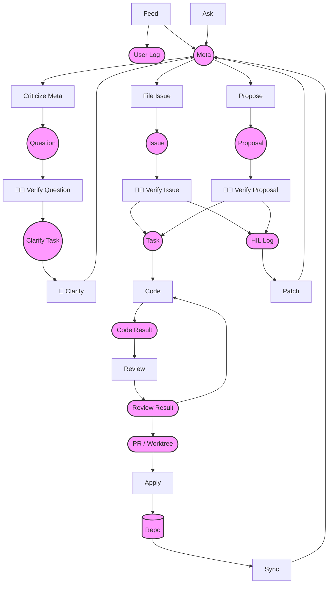

第一个切面，意图与现实

0. 元信息主要是清楚的体现用户意图与现实状态。

1. 用户意图驱动，用户意图是最高指导，需要谨慎对待，用户意图可以包括正向和负向意图。

2. 在同一个问题上，用户新的意图覆盖旧的意图

3. 不同的问题上如果意图有冲突，需要与用户确认

4. 用户意图可以来自于用户的输入、用户对于各种问题的反馈。

5. 不得从Repo中直接推断用户意图，但是可以提取之后向用户确认。

6. 现实状态要从Repo中去提取。

7. 用户也会提供一些外部的状态信息。

第二个切面，直观、宏观、微观

0. 元信息的目的就是把这个事情描述清楚，把一个事情描述清楚的方式是先直观，再宏观，再微观

1. 直观层面，要让人直观的知道这是一个什么事

2. 宏观层面，要让人过看之后有一个完整的信息结构

3. 微观层面，不存储细节信息，要做到知道信息去哪儿找，是以什么形式存在的，如何获取

第三个切面，来源和可追溯性

1. 所有信息必须标明来源，要么来自于对于用户输入的抽取和理解，要注明是用户的哪条输入（引用用户输入记录的编号），要么来自于对于Repo内容的总结（引用具体的来源）。

2. 不得有任何编造和推断的信息。

Issue分为以下几类，或者说可以从以下几个角度来找：
1. 用户意图的自我冲突。
2. 当前已经实现的部分与用户意图的冲突。（不管用户意图中没有实现的部分）
3. 项目现状中本身存在的问题，可以是结构性的，也可以是细节上的
4. 缺失重要信息，让人无法通过META了解项目
5. 验证失败，如果条件具备，参照信息中提供的方式进行测试验证，与预期结果不一致。

Suggestion从以下几个方面来提：
1. 用户意图中还没有实现的部分。
2. 当前已经实现，但是改进之后能更好的实现用户的意图
3. 当前的实现中可以进行的改进。

处理节点功能描述， 两个红点代表主要就是人工交互的节点，一个红点代表按需人工介入的节点，不带红点的节点是自动化的节点（或者只有当Fail时才会介入）
Feed["Feed"] ： laddermoon-feed skill
Ask["Ask"]  : 先不做
VerifyQuestion["🔴🔴  Verify Question"] : 不需要Skill， 只需要人给出判断和选择
VerifyIssue["🔴🔴  Verify Issue"] : 不需要Skill， 只需要人给出判断和选择
VerifyProposal["🔴🔴  Verify Proposal"] : 不需要Skill， 只需要人给出判断和选择
CriticizeMeta["Criticize Meta"] : laddermoon-criticize skill
FileIssue["File Issue"] : laddermoon-audit skill
Propose["Propose"] : laddermoon-propose skill
Apply["Apply"] : laddermoon-apply skill  主要就是Merge分支，如果Merge不成功，需要Claude或者人工介入解决冲突
Clarify["🔴 Clarify"] : laddermoon-clarify skill 通过分析代码，或者问人来解决Question
Sync["Sync"] : laddermoon-sync skill 同步Repo到Meta
Review["Review"] : laddermoon-review skill review PR
Code["Code"] : laddermoon-code skill 使用完成开发工作
Patch["Patch"] : laddermoon-patch skill 使用HIL Log的优化Meta ， 先不做

lm 所支持的命令：
lm init
lm sync
lm clarify # 不断调用 criticize skill 和 clarify skill，直到没有问题，用户消除Meta中的问题，
lm audit # 提出Issue并让用户分类判断，是否创建Task
lm propose # 提出Proposal并让用户判断是否创建Task
lm workon/solve <task> # 通过code skill进行开发，并通过review skill来验证，然后合并到分支
lm feed # 给输入，通过feed skill来获取用户意图，
lm ask # 回答问题，通过ask skill , 先不做
lm tasks [id] # show tasks [id] , without id, show all tasks oneline
lm issues [id] # show issues [id] , without id, show all issues oneline
lm proposals [id] # show proposals [id] , without id, show all proposals oneline
lm status # show status
lm meta # show meta
lm feedlog # show userlog
lm hilog # show hilog

lm # interactive mode

lm auto # 自动模式